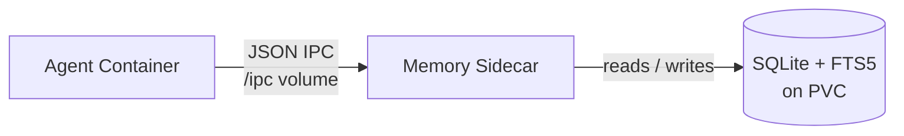

# Persistent Memory

Each `SympoziumInstance` can enable **persistent memory** — a SQLite database with FTS5 full-text search, served by a memory sidecar that runs alongside agent pods. The database lives on a PersistentVolume, so memory survives across ephemeral agent runs.

Agents interact with memory through three tools exposed via file-based JSON IPC (the same pattern used by MCP tools):

| Tool | Description |
|------|-------------|
| `memory_search(query, top_k?)` | Full-text search across stored memories. Returns the top _k_ results (default 10). |
| `memory_store(content, tags?)` | Store a new memory entry with optional tags for categorisation. |
| `memory_list(tags?, limit?)` | List memories, optionally filtered by tags. |

## How It Works

1. The `memory` SkillPack adds a **memory sidecar** (`cmd/memory-server/`) to the agent pod.
2. A **PersistentVolumeClaim** is created per instance to hold `memory.db` — the SQLite database.
3. The agent and memory sidecar share an `/ipc` volume. The agent writes JSON tool requests; the sidecar responds with results.
4. SQLite FTS5 indexes all stored content for fast full-text search.
5. Because the PVC outlives individual pods, memories persist across runs.



## Enabling Memory

Add the `memory` SkillPack to your instance's skills list:

```yaml
apiVersion: sympozium.ai/v1alpha1
kind: SympoziumInstance
metadata:
  name: my-agent
spec:
  skills:
    - skillPackRef: memory
```

Or reference it from a PersonaPack:

```yaml
apiVersion: sympozium.ai/v1alpha1
kind: PersonaPack
metadata:
  name: sre-watchdog
spec:
  personas:
    - name: sre-watchdog
      skills:
        - skillPackRef: k8s-ops
        - skillPackRef: memory
      memory:
        seeds:
          - "Track recurring issues for trend analysis"
          - "Note any nodes that frequently report NotReady"
```

Seed memories are inserted into the SQLite database when the instance is first created.

## SkillPack Configuration

The memory SkillPack is defined at `config/skills/memory.yaml`. It follows the standard SkillPack pattern — Markdown instructions mounted at `/skills/` plus a sidecar container:

- **Skills layer:** Instructions that teach the agent when and how to use `memory_search`, `memory_store`, and `memory_list`.
- **Sidecar layer:** The `memory-server` container that manages the SQLite database and responds to IPC requests.
- **No RBAC required:** The memory sidecar only accesses its own PVC — it does not talk to the Kubernetes API.

## Data Persistence

| Aspect | Detail |
|--------|--------|
| **Storage** | One PVC per instance, named `<instance>-memory` |
| **Database** | SQLite 3 with FTS5 extension |
| **Lifecycle** | PVC persists until the SympoziumInstance is deleted (or manually removed) |
| **Backup** | Standard PV backup tools apply (Velero, volume snapshots, etc.) |
| **Upgradeable** | The SQLite schema is designed to support a future upgrade path to vector search |

## Viewing Memory

View an agent's stored memories through the TUI:

```
/memory <instance-name>
```

Or query the database directly by exec-ing into the memory sidecar during a run:

```bash
kubectl exec <pod> -c memory-server -- sqlite3 /data/memory.db "SELECT content, tags FROM memories ORDER BY created_at DESC LIMIT 10;"
```

## Migration from ConfigMap Memory (Legacy)

The previous ConfigMap-based memory system (`<instance>-memory` ConfigMap with `MEMORY.md`) is preserved as a **legacy fallback**. If an instance has `spec.memory.enabled: true` but does not include the `memory` SkillPack, the controller falls back to the ConfigMap approach.

To migrate:

1. Add `memory` to the instance's skills list.
2. Existing ConfigMap memories can be imported by storing them via `memory_store` during the first run — the agent's skill instructions include guidance for this.
3. Once migrated, you can disable the legacy ConfigMap by removing `spec.memory.enabled` or setting it to `false`.

Both systems can coexist during the transition period. The memory sidecar takes precedence when both are present.
